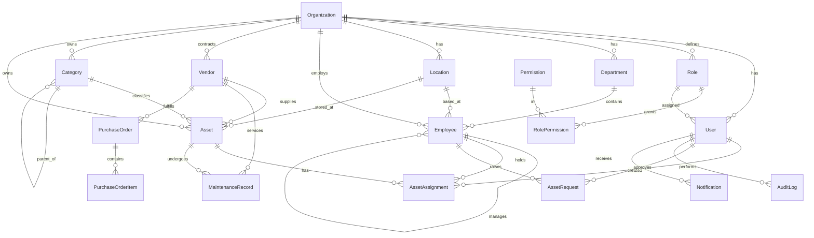

# Entity-Relationship Model

Prisma (`server/prisma/schema.prisma`) is the source of truth. Diagram below (Mermaid).



## Core entities

| Entity | Purpose | Key fields |
|--------|---------|-----------|
| **Organization** | Tenant boundary | `code` (unique) |
| **User** | Login principal | `email`, `passwordHash`, `roleId` |
| **Role / Permission / RolePermission** | RBAC | `permission.key = module:action` |
| **Department / Location** | Org structure | `code` per org |
| **Employee** | Asset holder | `employeeCode`, `managerId` (self-ref) |
| **Vendor** | Supplier | `code`, `rating` |
| **Category** | Asset class + depreciation policy | `depreciationRate`, `usefulLifeYears`, `parentId` |
| **Asset** | Tracked item | `assetCode`, `qrCode`, `status`, `condition`, `currentValue` |
| **AssetAssignment** | Check-out record | `status`, `assignedDate`, `actualReturnDate` |
| **MaintenanceRecord** | Service/AMC/warranty | `type`, `status`, `cost`, `nextDueDate` |
| **AssetRequest** | Self-service request | `requestCode`, `status` |
| **AuditLog** | Immutable trail | `action`, `module`, `entity`, `metadata` |

## Lifecycle (Asset.status)

```
AVAILABLE ──assign──► ASSIGNED ──return──► AVAILABLE
   │                                          │
   ├──► RESERVED ──► IN_TRANSIT               ├──► IN_MAINTENANCE ──► AVAILABLE
   │                                          │
   └──► RETIRED ──► DISPOSED        DAMAGED / LOST (exception states)
```
